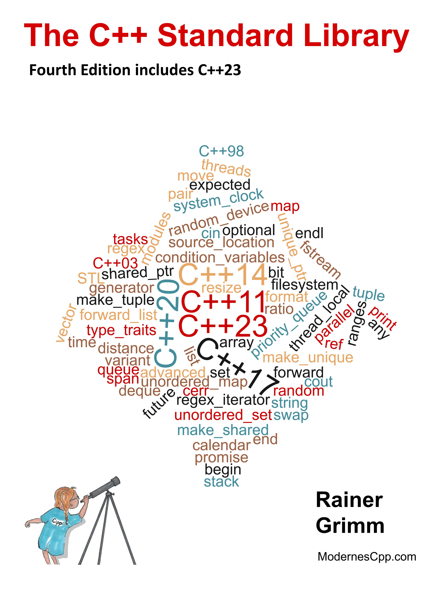

# The C++ Standard Library

*What every professional C++ programmer should know about the C++ standard library.  *

 

* 作者：Nicolai M. Josuttis
* 译者：陈晓伟
* 版本：2022-10-30

> 翻译是译者用自己的思想，换一种语言，对原作者想法的重新阐释。鉴于我的学识所限，误解和错译在所难免。如果你能买到本书的原版，且有能力阅读英文，请直接去读原文。因为与之相较，我的译文可能根本不值得一读。
>
> 
 — 云风，程序员修炼之道第2版译者

## 本书概述

The C++ Standard Library is a quick reference to the standard library of the current C++23 standard ISO/IEC 14882:2023¹. C++23 has more than 2100 pages and follows the big C++20 standard. In contrast, C++23 and C++17 are neither a big nor small C++ standards. C++14 is a small addition to C++11.
C++11 had more than 1,300 pages and was published in 2011. That was 13 years after the first and only C++ standard, C++98. Of course, there is also C++03, published in 2003. But C++03 is considered a bug-fix release.

This quick reference aims is to provide a concise reference to the C++ standard library. This book assumes that you are familiar with C++. If so, you will get the most benefit out of this book. If C++ is new to you, you should start with a textbook about core C++. Once you have mastered a book about the core language, you can make your next big step by reading this book. To make your job easier, I have provided many short code snippets to connect theory and practice.

## 作者简介

I’ve worked as a software architect, team lead, and instructor since 1999. In 2002, I created companyintern meetings for further education. I have given training courses since 2002. My first tutorials were about proprietary management software, but I began teaching Python and C++ soon after. I like to write articles about C++, Python, and Haskell in my spare time. I also like to speak at conferences. I publish weekly on my English blog Modernes Cpp⁵, and the German blog⁶, hosted by Heise Developer.

Since 2016, I have been an independent instructor giving seminars about modern C++ and Python. I have published several books in various languages about modern C++ and, in particular, about concurrency. Due to my profession, I always search for the best way to teach modern C++.

## 本书相关

* Github地址：https://github.com/xiaoweiChen/The-CXX-Library-Fourth-EDdition-include-CXX23

* 译文的LaTeX 环境配置：https://www.cnblogs.com/1625--H/p/11524968.html
  * 禁用拼写检查：https://blog.csdn.net/weixin_39278265/article/details/87931348

  * 使用xelatex编译时需要添加`-shell-escape`和`-8bit`选项，例如：

    `xelatex -synctex=1 -interaction=nonstopmode -shell-escape -8bit "C++-Standard-Library".tex`

  * 为了内容中表格和目录索引能正常生成，需要至少两次连续编译

* vscode中配置LaTeX：https://blog.csdn.net/Ruins_LEE/article/details/123555016

